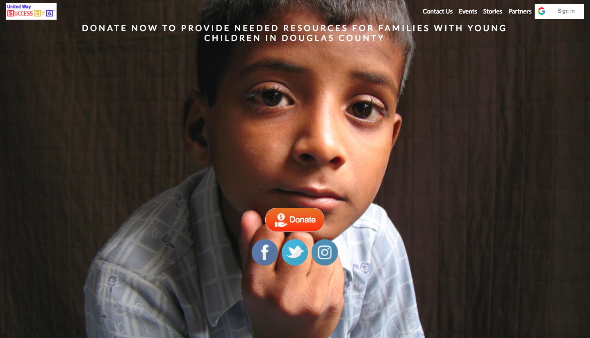
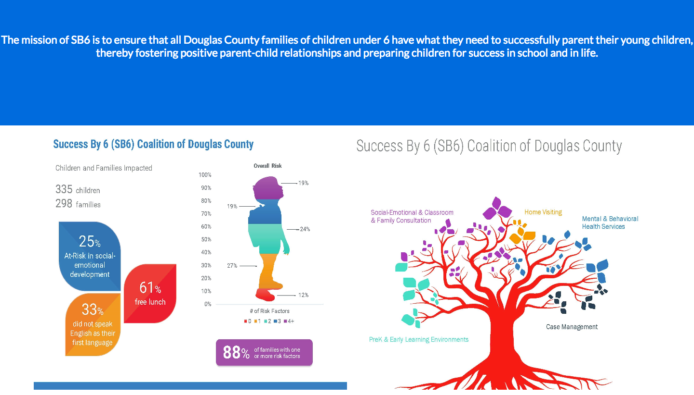
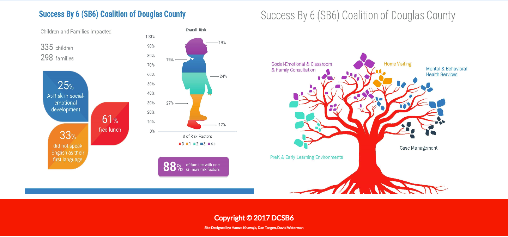

# DCSB6-Project

The mission of SB6 is to ensure that all Douglas County families of children under 6 have what they need to successfully parent their young children, thereby fostering positive parent-child relationships and preparing children for success in school and in life.

##Getting Started

You can view the current version approved by the SB6 board at: 

[Douglas County Success By 6](https://www.dcsb6.org)  

##Team JayhawkHDD Version of DCSB6.ORG

Below you can view the design implemented by JayhawkHDD. 

###Home page

   

   

   

